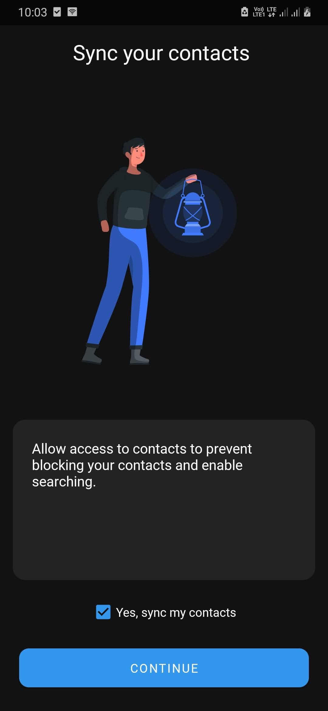
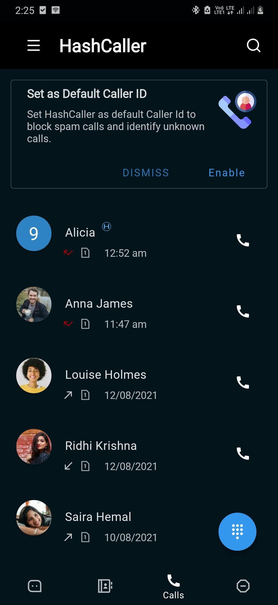
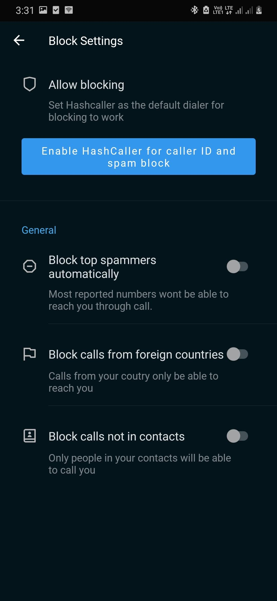
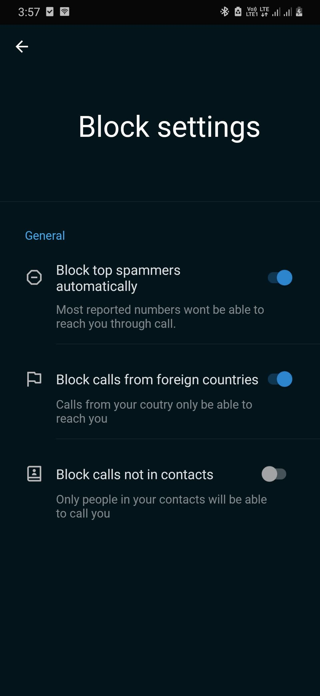
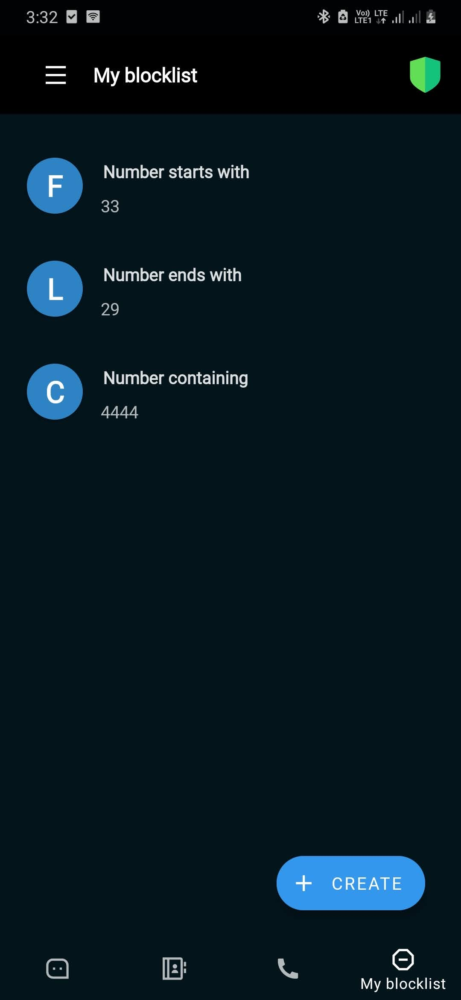

# HashCaller

**HashCaller** is a secure and innovative hash-based Caller ID and Call Blocking application. It leverages cutting-edge technology to keep your phone numbers safe using secure hashing functions.

---

## Features

- **Hash-Based Caller ID and Call Blocking**: Protects user privacy by securely hashing phone numbers.
---

## Screenshots

### Landing Page

### Call Log

### Contact Management

### Settings

### Blocklist

### Popup Notification

---

## Technical Stack

### Backend
- **TypeScript**: Clean code implementation for API logic.
- **Nginx**: Load balancing for better scalability.
- **MongoDB**: Secure storage with hashed data.

### Frontend
- **Kotlin and Java**: Android app development using MVVM architecture.

